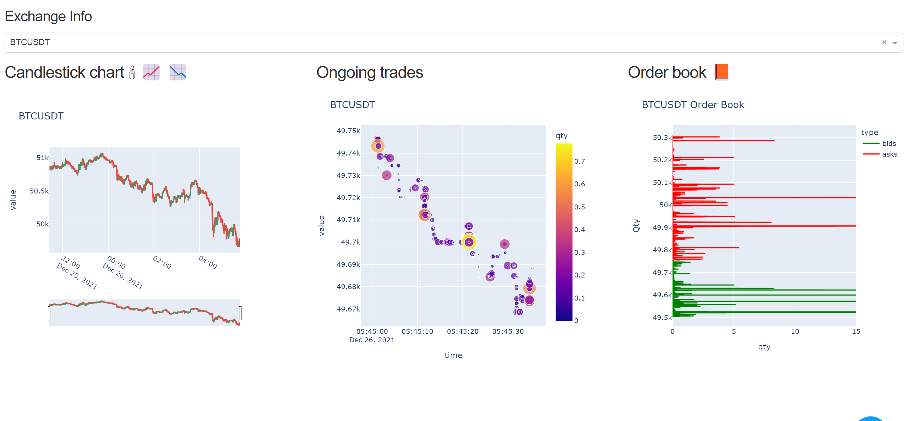

# Binance
Steps to get it working, 
1. It uses [Binance API written in python](https://python-binance.readthedocs.io/en/latest/overview.html)
  - Create binance account, generate API (key,secret)
  - <code> pip install python-binance </code> 
2. [Dash plotly](https://dash.plotly.com/installation) interactive plotting library which works around pandas dataframes, See [Dash](https://dash.plotly.com/installation)
  - <code> pip install dash</code>
  - <code> pip install pandas</code>

# Uses
From observing it and some previous knowledge of markets:
On the marketplace, buyers and sellers spawn their orders. Soon, corresponding sellers and buyers match with the existing orders. Price is the viable orders that can be executed which have an bid for an ask, price of that commodity in that market is the value at which that order is executed. 
More buyers near the price creates a demand, which if left unfulfilled, can force buyers to buy for the higher price, which raises the price curve. If satisfied, prices remain relatively stable. If the sells are abundant offering plenty relative to buyers, if they want to sell, prices are forced downwards which lowers the price curve.

Change of price on a candlestick chart is an indicator of unbalanced demand caused by buyers and supply caused by sellers.

Now looking at this market, one can spend their time by buying and selling the commodity and not actually do anything with it, treating the commodity as intangible and untouched. Which is counted as an investment of owning that commodity.
Buying the commodity at lower price and later selling at higher price generates profit for the trader. 
Owning the asset by gaining it through another means and selling it in the market may generate profit for the trader.

Note: May work sluggishly.
